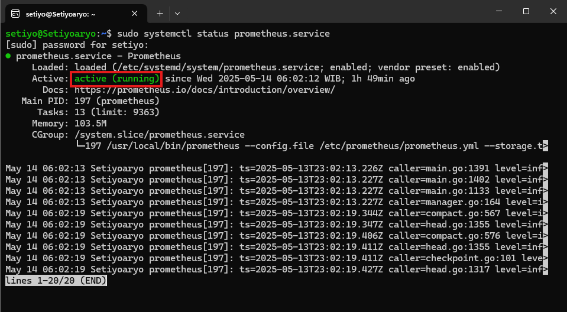
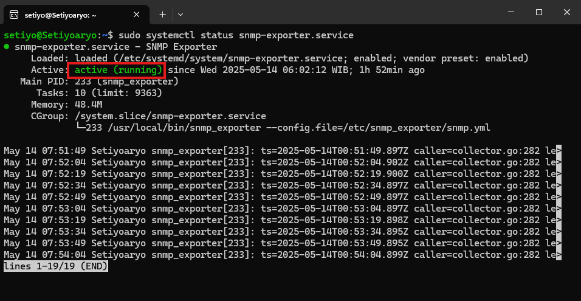
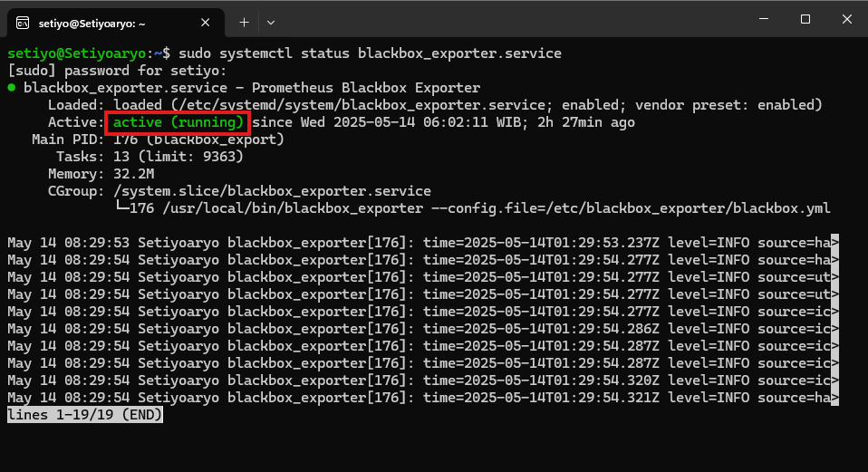
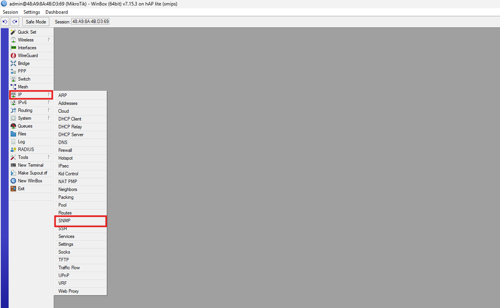
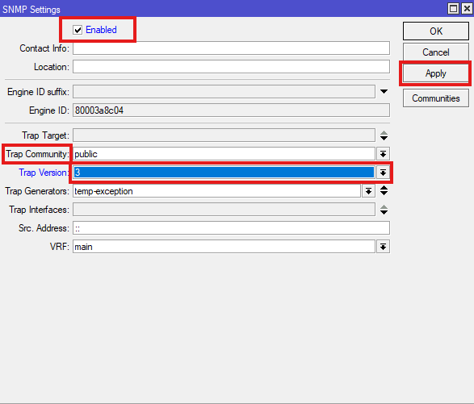

# Membuat-tools-monitoring-Mikrotik-menggunakan-Prometheus-dan-Grafana

### Requirements
  1. [Prometheus](https://prometheus.io/download/)
  2. [Grafana](https://grafana.com/)
  3. [Snmp_exporter](https://github.com/prometheus/snmp_exporter)
  4. [Blackbox Exporter](https://prometheus.io/download/)

## PROMETHEUS

### Download Prometheus
```Shell
wget https://github.com/prometheus/prometheus/releases/download/v2.53.4/prometheus-2.53.4.linux-amd64.tar.gz
tar xvf prometheus-2.53.4.linux-amd64.tar.gz
cd prometheus-2.53.4.linux-amd64/
```
### Pindahkan File Prometheus dan Promtool
```Shell
sudo mv prometheus promtool /usr/local/bin/
```
### Buat User dan Group khusus untuk Prometheus
```Shell
sudo groupadd --system prometheus
sudo useradd --system -s /sbin/nologin -g prometheus prometheus
```
### Pindahkan console_libraries, console, dan prometehus.yml ke directory /etc/prometheus/
```Shell
sudo mkdir /etc/prometheus
sudo mv consoles/ console_libraries/ prometheus.yml /etc/prometheus/
```
### Membuat Directory prometheus di /var/lib/ dan ubah ownership menjadi user dan grub yang sudah dibuat sebelumnya
```Shell
sudo mkdir /var/lib/prometheus
sudo chown -R prometheus:prometheus /var/lib/prometheus/
```
### Membuat File Unit .service untuk Menjalankan Prometheus sebagai Layanan
```Shell
sudo nano /etc/systemd/system/prometheus.service
```
### Konfigurasi File .service
Pada ExecStart pastikan path sudah sesuai yang dibuat sebelumnya /usr/local/bin/prometheus
```Service
[Unit]
Description=Prometheus
Documentation=https://prometheus.io/docs/introduction/overview/
Wants=network-online.target
After=network-online.target

[Service]
User=prometheus
Group=prometheus
Type=simple
ExecStart=/usr/local/bin/prometheus \
--config.file /etc/prometheus/prometheus.yml \
--storage.tsdb.path /var/lib/prometheus/ \
--web.console.templates=/etc/prometheus/consoles \
--web.console.libraries=/etc/prometheus/console_libraries

[Install]
WantedBy=multi-user.target
```
CTRL + O untuk save file konfigurasi dan reload
```Shell
sudo systemctl daemon-reload
```

### Enable & Auto start prometheus.service
```Shell
sudo systemctl enable --now prometheus.service
```
```Shell
sudo systemctl status prometheus.service
```
**Pastikan status prometheus.service Active dan Running**



## SNMP-EXPORTER

### Download SNMP-EXPORTER
```Shell
wget https://github.com/prometheus/snmp_exporter/releases/download/v0.21.0/snmp_exporter-0.21.0.linux-amd64.tar.gz
tar xvf snmp_exporter-0.21.0.linux-amd64.tar.gz
cd cd snmp_exporter-0.21.0.linux-amd64/
sudo mv snmp_exporter /usr/local/bin/
```
### Buat Directory untuk konfigurasi .yml
```Shell
sudo mkdir /etc/snmp_exporter
sudo mv snmp.yml /etc/snmp_exporter/
```
### Buat File Konfigurasi .service untuk snmp-exporter
```Shell
sudo nano /etc/system/systemd/snmp-exporter.service
```
### Konfigurasi snmp-exporter.service
Pada ExecStart jika path berbeda, bisa di sesuaikan
```Service
[Unit]
Description=SNMP Exporter
After=network-online.target

# This assumes you are running snmp_exporter under the user "prometheus"

[Service]
User=prometheus
Restart=on-failure
ExecStart=/usr/local/bin/snmp_exporter --config.file=/etc/snmp_exporter/snmp.yml

[Install]
WantedBy=multi-user.target
```
```Shell
sudo systemctl daemon-reload
```

### Enable & Auto start snmp-exporter.service
```Shell
sudo systemctl enable --now snmp-exporter.service
sudo systemctl status snmp-exporter.service
```
**Pastikan status snmp-exporter.service Active dan Running**




## BLACKBOX-EXPORTER

### Download Blackbox-Exporter
```Shell
wget https://github.com/prometheus/blackbox_exporter/releases/download/v0.26.0/blackbox_exporter-0.26.0.linux-amd64.tar.gz
tar xvf blackbox_exporter-0.26.0.linux-amd64.tar.gz
cd blackbox_exporter-0.26.0.linux-amd64/
sudo mv blackbox_exporter /usr/local/bin/
```
### Buat directory untuk konfigurasi .yml
```Shell
sudo mkdir /etc/blackbox_exporter
sudo mv blackbox.yml /etc/blackbox_exporter/
```
### Buat File konfigurasi .service untuk blackbox-exporter
```Shell
sudo nano /etc/system/systemd/blackbox-exporter.service
```
### Konfigurasi blackbox-exporter.service
Pada ExecStart jika path berbeda, bisa di sesuaikan
```Service
[Unit]
Description=Prometheus Blackbox Exporter
Wants=network-online.target
After=network-online.target

[Service]
User=nobody
Group=nogroup
Type=simple
ExecStart=/usr/local/bin/blackbox-exporter \
  --config.file=/etc/blackbox_exporter/blackbox.yml

Restart=on-failure

[Install]
WantedBy=multi-user.target
```
```Shell
sudo systemctl daemon-reload
```
### Enable & Auto start blackbox-exporter.service
```Shell
sudo systemctl enable --now blackbox-exporter.service
sudo systemctl status blackbox-exporter.service
```

**Pastikan status blackbox-exporter.service Active dan Running**




## KONFIGURASI PROMETHEUS

### Konfigurasi prometheus.yml
```Shell
sudo nano /etc/prometheus/prometheus.yml
```
Hapus konfigurasi bawaan prometheus.yml dan ganti dengan versi dibawah ini
```yml
global:
  scrape_interval: 15s # Set the scrape interval to every 15 seconds. Default is every 1 minute.
  evaluation_interval: 15s # Evaluate rules every 15 seconds. The default is every 1 minute.

scrape_configs:
  - job_name: "prometheus"
    static_configs:
      - targets: ["localhost:9090"]
  - job_name: 'mikrotik-snmp'
    static_configs:
      - targets:
        - 192.168.100.1  # Di isi IP Address Mikrotik
        - x.x.x.x # Tambahkan jika lebih dari 1 perangkat Mikrotik (hapus jika tidak perlu)
    metrics_path: /snmp
    params:
      auth: [public_v2]
      module: [mikrotik]
    relabel_configs:
      - source_labels: [__address__]
        target_label: __param_target
      - source_labels: [__param_target]
        target_label: instance
      - target_label: __address__
        replacement: 127.0.0.1:9116

  - job_name: 'ping-google'
    scrape_interval: 5s
    scrape_timeout: 4s
    metrics_path: /probe
    params:
      module: [icmp]
    static_configs:
      - targets:
        - 8.8.8.8 # Bebas di isi ke IP manapun (berfungsi untuk memonitoring ping ke host tujuan)
        - 1.1.1.1 # Target 2 (tambahkan di bawahnya jika perlu)
    relabel_configs:
      - source_labels: [__address__]
        target_label: __param_target
      - source_labels: [__param_target]
        target_label: instance
      - target_label: __address__
        replacement: 127.0.0.1:9115 
```

### Restart Service Prometheus
```Shell
sudo systemctl restart prometheus.service
```

## MIKROTIK

### Aktifkan SNMP di perangkat Mikrotik
Jika digunakan di router produksi, tidak disarankan menggunakan community public (Security Risk)

RosV6
```Shell
/snmp set enabled=yes trap-version=3
/snmp community add name=public read-access=yes
```
RosV7
```Shell
/snmp/set enabled=yes trap-version=3
/snmp/community/add name=public read-access=yes
```




## Install Grafana

### Install the prerequisite packages:
```Shell
sudo apt-get install -y apt-transport-https software-properties-common wget
```
### Import the GPG key
```Shell
sudo mkdir -p /etc/apt/keyrings/
wget -q -O - https://apt.grafana.com/gpg.key | gpg --dearmor | sudo tee /etc/apt/keyrings/grafana.gpg > /dev/null
```
### add a repository for stable releases
```Shell
echo "deb [signed-by=/etc/apt/keyrings/grafana.gpg] https://apt.grafana.com stable main" | sudo tee -a /etc/apt/sources.list.d/grafana.list
```
### add a repository for beta releases
```Shell
echo "deb [signed-by=/etc/apt/keyrings/grafana.gpg] https://apt.grafana.com beta main" | sudo tee -a /etc/apt/sources.list.d/grafana.list
```
### Update
```Shell
sudo apt-get update
```
### Install Grafana
```Shell
sudo apt-get install grafana
```


